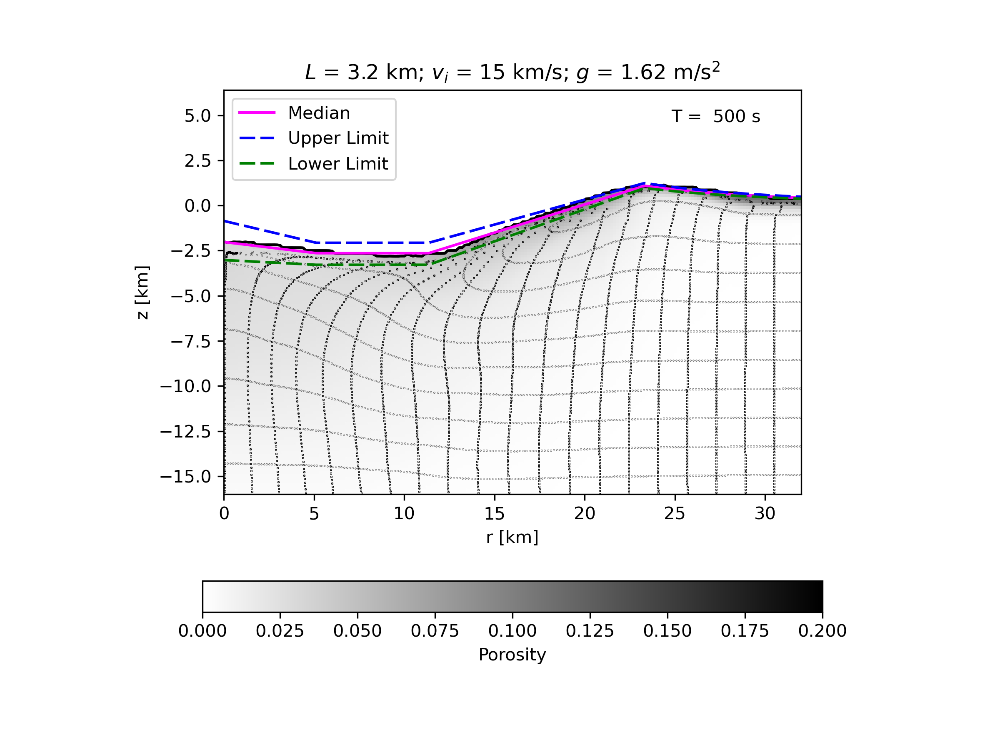
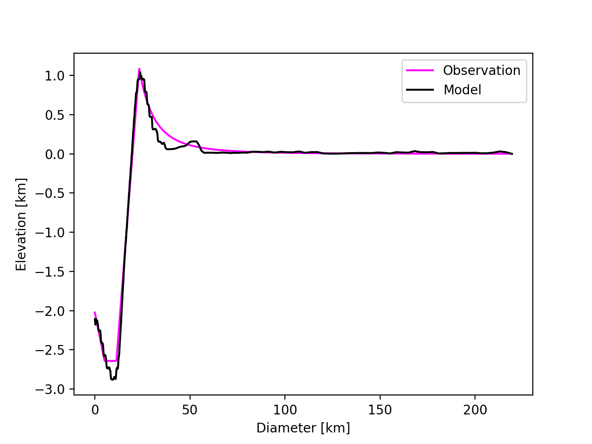
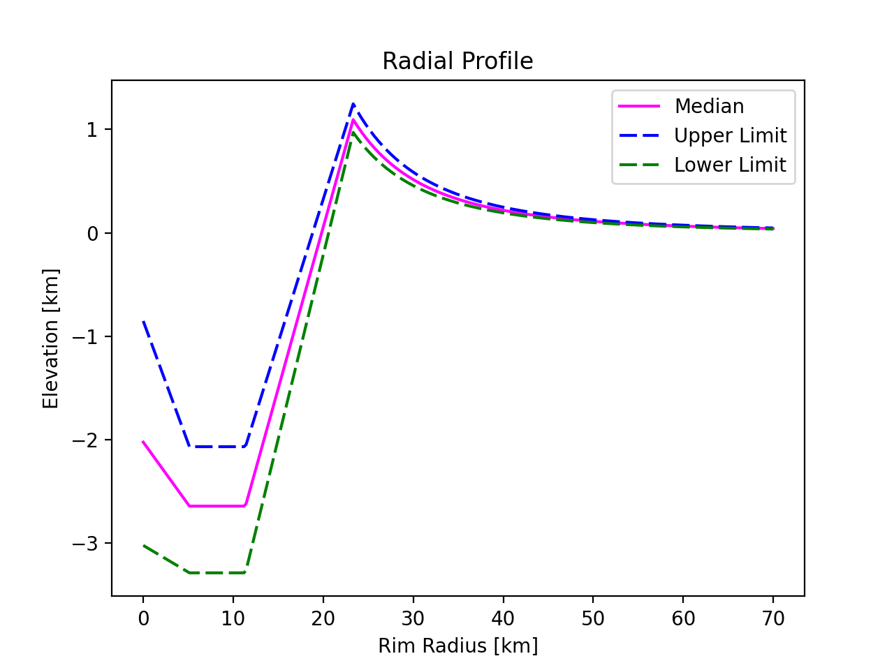

# Impact Crater-Scaling

## About
'Crater Scaling' is a method used to relate the size and shape of each impact crater to the properties of the impactor and target surface. 

The primary objective of this project is to test and improve the crater scaling method using recent improvements to numerical models of the impact cratering process and new spacecraft observations from the Moon. This will help improve the crater scaling relationships for so-called ‘complex’ craters within a size range of 10-200 km in diameter. This study is then extended to craters of larger sizes called 'peak ring basins'.

The crater scaling equations from the observational data are then compared with the numerical simulations generated using iSALE. 

## Running Python Files

### Getting the Diameter value from the optimising algorithm
* Make sure the python scripts are stored in the 'Plotting' directory. Then run them from:
```
cd iSALE-master/share/examples/dilatancy
```
* Open the python script `error_script.py` and open the simulation data file of choice:
```python
model = psp.opendatfile('Dilatancy_moon45/jdata.dat', scale='km')
```
* Then open the `dilatancy_obs.py` python script and make sure the same data file is being opened there and the last time step is the same in both the scripts
```python
model = psp.opendatfile('Dilatancy_moon45/jdata.dat', scale='km')  
x_mod, y_mod = model.surfaceProfile(660, returnx=True) 
```

* Next step is to make sure the number of time steps is correct and check which solver is being used for the optimising function. The default solver is 'BFGS',however, for larger impactor sizes it is more appropriate to use 'Nelder-Mead' or 'Powell'.
```python
o = optimize.minimize(optimizer_function, 200, method= 'Powell')
```
* Then run the script using the following command line. This will output the required rim-crest diameter value for that simulation as well as the root-mean square error. The script also creates a plot of RMS error Vs Rim-Diameter for a range of values for a visual representation.
```
python Plotting/error_script.py
```
### Using the Diameter value to overlay the observational profile on the simulation
* Open the python script which plots the simulations. It is already pre-programmed to overlay the observational profile on the last time step.
* Run the script using the following command where the number represents the D value derived from the optimiser.
```
python Plotting/porosity_snapshots_moon45.py 46.65040839
```
* Both the crater metrics from the simulation as well as the observational lunar crater metrics are printed which can be compared. 
* Go to the directory `Plots_moon45` where the images are stored as png files and the last image should look like


* The aim is to create a match between the median profile (exhibited in pink) to the simulation. 
* To overlay the observational median profile on the simulation independently go to `error_script.py` and uncomment the last few lines of the script. Input the diameter value of choice that the optimiser suggests and run the script as instructed before i.e 
```
python Plotting/error_script.py
```
* A plot like this should be the output
 

### To make changes to the crater-scaling equations 
* To modify the crater scaling equations for crater depth, peak height, floor radius, rim height etc go to `dilatancy_obs.py`
* The power law equations can be modified depending on the results derived from quantile regression.
* Remember the function below plots the 3 radial profiles- median, upper limit and lower limit and also prints the lunar crater parameter values.
```python
lunar_crater_characteristics(D, plt=None, norm=True, debug=True)
```
* After making any changes to the equations, to preview what the radial profiles look like before plotting on the actual simulations run the script: 
```
python Plotting/dilatancy_obs_imp.py <D> <True/False>
```
* Input any Diameter value in the above command line to check if the radial profiles look correct and also set `norm= True/False` depending on whether normalised or un-normalised radii values wish to be used.
* As an example, the radial profile for an input D = 46 km looks like this

 

## Contact
* namya.baijal18@imperial.ac.uk

 


